2# Procesverslag
Markdown is een simpele manier om HTML te schrijven.  
Markdown cheat cheet: [Hulp bij het schrijven van Markdown](https://github.com/adam-p/markdown-here/wiki/Markdown-Cheatsheet).

Nb. De standaardstructuur en de spartaanse opmaak van de README.md zijn helemaal prima. Het gaat om de inhoud van je procesverslag. Besteedt de tijd voor pracht en praal aan je website.

Nb. Door *open* toe te voegen aan een *details* element kun je deze standaard open zetten. Fijn om dat steeds voor de relevante stuk(ken) te doen.

## Jij

  
uitwerken voor kick-off werkgroep

  ### Auteur:
  Esra Kahraman

  #### Je startniveau:
  Blauwe piste

  #### Je focus:
  Surface plane
 

## Je website

  
uitwerken voor kick-off werkgroep

  ### Je opdracht:
  link naar de website die je gaat namaken óf de naam/omschrijving van je eigen ontwerp
  https://www.nike.com/nl/

  #### Screenshot(s) van de eerste pagina (small screen): 
  Nike.com home
  
  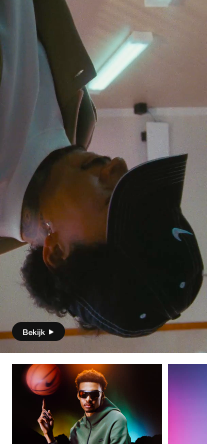

  #### Screenshot(s) van de tweede pagina (small screen):
   Lifestyle Tech Fleece
  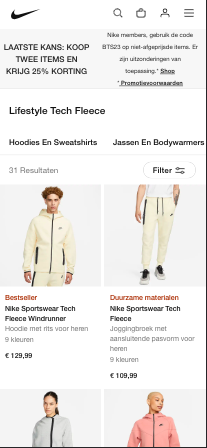
 

## Toegankelijkheidstest 1/2 (week 1)

  
uitwerken na test in 2e werkgroep

  ### Bevindingen
  Lijst met je bevindingen die in de test naar voren kwamen:
  - Op groot scherm zijn de lettergroottes in het menu nog wel te lezen, maar op klein scherm is het amper te lezen;
  - Er is weinig variatie om te kunnen navigeren. Ik merk bijvoorbeeld dat je bij de VoiceOver niet kunt navigeren met tab/pijl toetsen;
  - Sommige subteksten zijn in het grijs, maar dat is niet altijd even handig omdat het niet voor iedereen leesbaar is;
  - De VoiceOver leest bij het menu bij ieder subcategorie "main-menu" en dan het subkopje dat er bij hoort. Heel vervelend als je naar de laatste link moet en alles dus dubbel hoort aan het begin.

## Breakdownschets (week 1)

  
uitwerken na afloop 3e werkgroep

  ### de hele pagina: 
  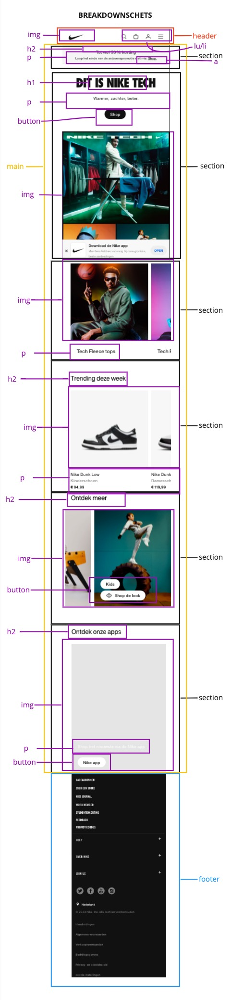

  ### dynamisch deel (bijv menu): 
  

  ### wellicht nog een dynamisch deel (bijv filter): 
  

## Voortgang 1 (week 2)

  
uitwerken voor 1e voortgang

  ### Stand van zaken
  hier dit ging goed & dit was lastig (neem ook screenshots op van delen van je website en code)

  ### Agenda voor meeting
  samen met je groepje opstellen

  ### Verslag van meeting
  hier na afloop snel de uitkomsten van de meeting vastleggen

  - We hebben correcte html even opnieuw doorgenomen
  - Ik heb het downloaden van fonts goed genoteerd, dit moet lukken
  - Ik moet nog even mijn html afschrijven

## Voortgang 2 (week 3)

  
uitwerken voor 2e voortgang

  ### Stand van zaken
  Ik heb mijn html er in gezet en ik heb alvast een begin gemaakt aan mijn css. Ik loop alleen tegen een paar dingen aan, maar ik hoop die op te kunnen lossen door het te bespreken met een klasgenoot of door het te vragen aan een van de student-assistenten.
  - Het installeren van de fonts ging in een keer goed! Ik had het nog goed onthouden van de lessen.
  - Ik ben momenteel bezig met de hamburger menu en de carrousels. Als ik dit eenmaal door heb, kan ik voortgang maken.

  ### Agenda voor meeting
  samen met je groepje opstellen

  Esra
  - Ik struggle op dit moment met mijn iconen rechts krijgen in het menu. Ik wil dat het logo rechts blijft, en mijn logo links.
  - Mijn afbeelding in de eerste section is heel condensed terwijl ik wel de juiste afmetingen en afbeelding heb gebruikt.

 Student 1 Sarah
  - Header images overhoop gehaald hoe fix ik het weer
  - Hoe maak ik een button van een img en een woord samen

-Hoe spreek ik alleen het logo aan, laatste img van de header in de 2e nav

  Student 2 Jornt
  - Ik wil graag weten hoezo mijn 2e section niet het scherm volledig vult.
  - waarom kan ik de 'font-weight' van m'n nav niet aanpassen? 
  - Bepaalde afbeelding laadt niet bij testen telefoon, hoe komt dat?

  Student 3 Liam
  - Afbeeldingen carousel met animiatie
  - Nth of type voor de kleur van tekst lukt niet
  - Hoe kun je het beste de iconen in de navbar doen

  Student 4 Karenza
  - @fontface snap ik even niet, verschil tussen flex en grid (wanneer is wat beter)

  ### Verslag van meeting
  hier na afloop snel de uitkomsten van de meeting vastleggen

  - 
  - punt 2
  - nog een punt
- ...

## Toegankelijkheidstest 2/2 (week 4)

  
uitwerken na test in 9e werkgroep

  ### Bevindingen
  Lijst met je bevindingen die in de test naar voren kwamen (geef ook aan wat er verbeterd is):

## Voortgang 3 (week 4)

  
uitwerken voor 3e voortgang

  ### Stand van zaken
  Het lukte mij om carrousels te maken en om voortgang te maken met mijn website.
  De dingen waar ik tegen aan liep:
  - Hoe zorg ik ervoor dat de tekst in een section automatisch veranderd?
  - Hoe roep ik de eerste p in een section aan?
  - Hoe krijg ik de Jordan en Converse in mijn nav onder elkaar?

  ### Agenda voor meeting
Jornt:
- Waarom blijft niet mijn gehele NAV bar plakken?
- Hoe krijg ik m’n tekst in dit sectie 4 responsive?
- Er zijn maar 3 fonts beschikbaar om te downloaden, lukt niet om font-weight mee te geven.

Karenza:
- Ik heb ook vraag over responsive text / footer
- En een vraag over “overlappen” van fotos/backgrounds
- Vraag over alt attributen en hoe specifiek de uitleg van de foto moet zijn.
- En eigenlijk gwn meer uitleg over responsiveness

Sarah:
- Ik kan de fonts niet vinden omdat ze geen duidelijke namen hebben
- Hoe maak ik een rondje boven het winkelmandje
- Hoe krijg ik een link en een p die onder elkaar staan, dichter op elkaar

Liam:
- Hoe krijg ik 3 verschillende menu opties
- Hoe maak ik slideshow met animaties
- Hoe zorg ik ervoor dat ik verschillende menus kan sluiten met 1 knop

  ### Verslag van meeting
  hier na afloop snel de uitkomsten van de meeting vastleggen

  - Ik heb code gekregen die zeer handig is voor mijn website, en die ben ik zeker van plan om toe te passen! Ook ga ik meer hulp vragen bij de student-assistenten over mijn hamburgermenu, want dat wilt nog niet echt lukken. Ik ga natuurlijk ook zelf verder proberen te werken aan m'n website. 

## Eindgesprek (week 5)

  
uitwerken voor eindgesprek

  ### Je uitkomst - karakteristiek screenshots:
  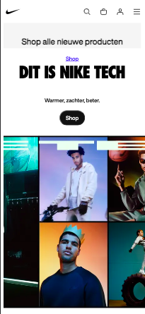
  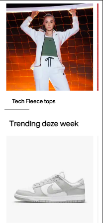
  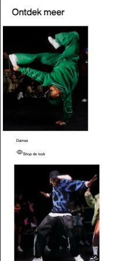
  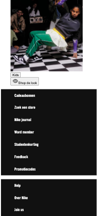

  ### Dit ging goed/Heb ik geleerd: 
  Paar elementen in mijn website gingen in een keer goed, en dat is heel fijn als het coderen af en toe niet mee wil werken. Het maken van mijn nav bar en de caroussels verliep best wel goed af namelijk. Het hielp ook heel erg dat we het meeste in de lessen al hadden doorgenomen en geoefend.

  
  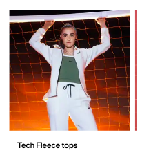

  ### Dit was lastig/Is niet gelukt:
  - Het is mij niet gelukt omn het hamburger menu te laten werken. Ik had Donna om hulp gevraagd daarbij en die heeft heel lief geholpen, maar zodra ik er zelf mee ging werken verdween al het inhoud. 
  - De code die ik heb gekregen voor de eerste section werkte gelukkig wel, alleen kreeg ik de inhoud niet in de section. Het zweeft er een beetje boven lijkt wel. Ook dit heb ik geprobeerd om zelf eerst op te lossen, maar is helaas niet gelukt.
  - Onderaan de pagina heb ik buttons die in een afbeelding moeten en de afbeeldingen ook nog een caroussel moeten. Dit is mij ook niet gelukt. Ik heb geprobeerd om met position relative en absolute te werken, maar ik denk dat ik iets fouts heb gedaan in mijn html, want het wil niet meewerken.
  - Helaas ben ik ook nog niet toegekomen aan de surface plane en toegankelijkheid.

  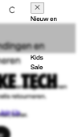
  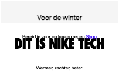
  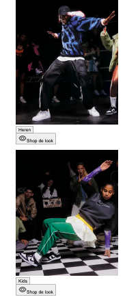

Aanpassingen herkansing samenvatting:
Heel veel dingen heb ik kunnen oplossen: Ik heb mijn html gevalideerd en de fouten verbeterd. Ik heb drie css bestanden, aria labels toegevoegd en mijn hamburger menu gefixt. Overal alt attributen. states toegevoegd. Dark mode toegevoegd.
het enige wat niet gelukt is: ik heb het niet helemaal toegankelijk kunnen maken helaas.

Eindgesprek herkansing samenvatting:
Bij het vorige eindgesprek hebben we besproken dat ik de volgende punten nog ga aanpassen:
- Prefers reduced motion toevoegen;
- Skip links toevoegen;
- H3, H4, alle koppen en subkoppen beter gebruiken;
- Alle overeenkomende css voor beide pagina's in een stylesheet zetten;
- Alle afbeeldingen een width van 100% geven om het mee te kunnen schalen;
- Quotes om de fonts heen zetten;
- Van de drie footers één footer maken en ul gebruiken bij ieder stukje;
- De lay-out van de tweede pagina verbeteren, responsive maken;
- De nav verbeteren, responsive maken.

## Bronnenlijst

  
continu bijhouden terwijl je werkt

  Nb. Wees specifiek ('css-tricks' als bron is bijv. niet specifiek genoeg). 
  Nb. ChatGpT en andere AI horen er ook bij.
  Nb. Vermeld de bronnen ook in je code.

  1. caroussels: code van de les sanne
  2. javascript: donna en liam micro interactie
  3. tekst die telkens veranderd in de 1e section: sanne
  4. fontface code van de les sanne
  5. voor de skip links en voor de reduced motion heb ik chatgpt gebruikt, ik kan de code een beetje uitleggen
  6. voor de lay-out van de tweede pagina heb ik ook chatgpt gebrukt. ook deze code kan ik deels zelf uitleggen

